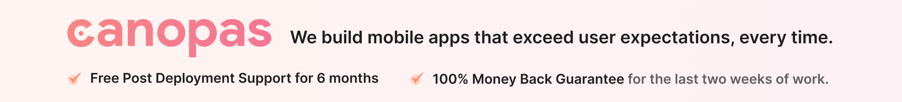
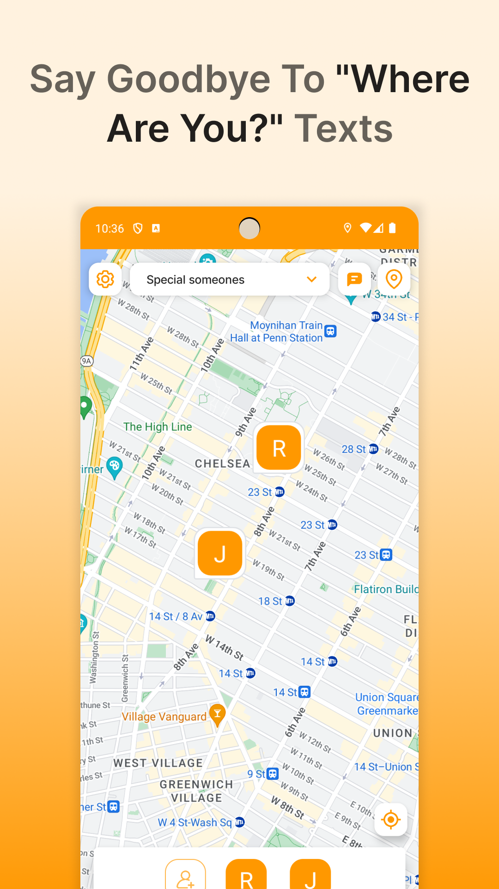
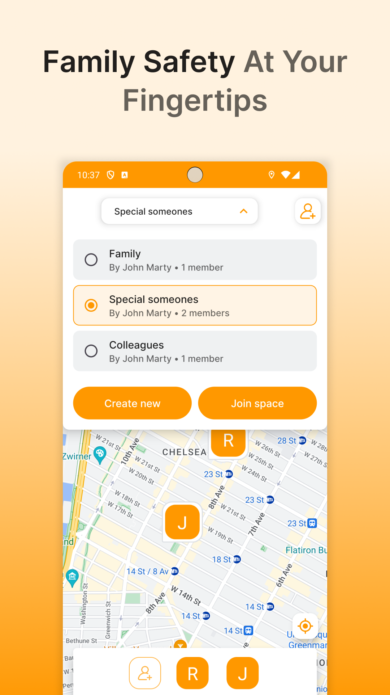
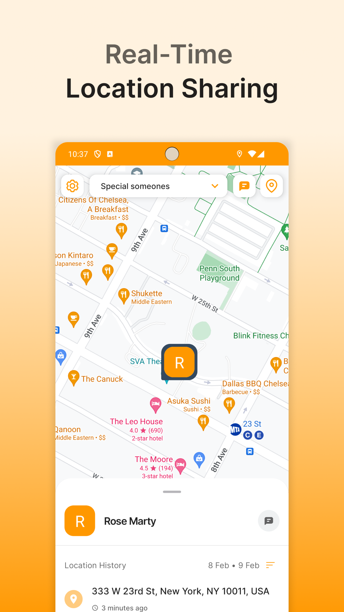
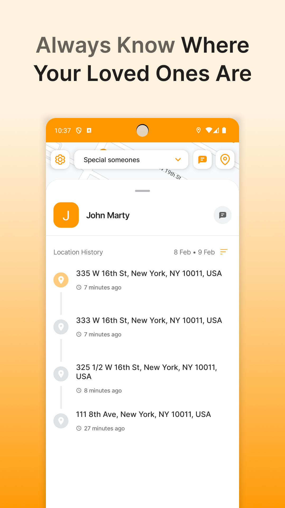

<p align="center"> <a href="https://canopas.com/contact"></a></p>

<p align="center">  If you are interested in building apps or designing products, please let us know. We'd love to hear from you!</p>

<p align="center"> <a href="https://canopas.com/contact"></a></p>


# YourSpace - Stay connected, Anywhere!


## Overview
Welcome to YourSpace, an open-source Android application designed to enhance family safety through real-time location sharing and communication features. YourSpace aims to provide peace of mind by ensuring the safety of your loved ones and facilitating seamless communication regardless of their location.

YourSpace adopts the MVVM architecture pattern and leverages Jetpack Compose for building modern UIs declaratively. This architecture ensures a clear separation of concerns, making the codebase more maintainable and testable. Jetpack Compose simplifies UI development by allowing developers to define UI elements and their behavior in a more intuitive way, resulting in a seamless user experience.

Download now and elevate your family's safety today!

<a href="https://play.google.com/store/apps/details?id="></a>

## Features
YourSpace is currently in active development 🚧, with plans to incorporate additional features shortly. Some of the core features include:

- Real-time Location Sharing: Keep track of your family members' whereabouts in real-time, ensuring their safety and providing peace of mind.
- Create/Join Space: Establish or join a trusted space with your loved ones, enabling secure communication and sharing of location information within the group.
- Detailed Location History: Access detailed location history to monitor the movements of your family members over time.
- Real-time Alerts: Receive instant alerts for important events such as entering or leaving designated areas, ensuring timely notifications.
- Geo-fencing: Set up geo-fences to define safe areas and receive alerts when family members enter or leave these areas.
- Communicate Securely: Engage in secure communication with your loved ones within the app, ensuring privacy and confidentiality of conversations.
- Check-Ins: Allow family members to check in to indicate their safe arrival at a destination.
- SOS Help Alert: Quickly send an SOS alert to trusted contacts in case of emergencies, ensuring prompt assistance when needed.

## Screenshots

    

## Requirements
Make sure you have the latest stable version of Android Studio installed.
You can then proceed by either cloning this repository or importing the project directly into Android Studio, following the steps provided in the [documentation](https://developer.android.com/jetpack/compose/setup#sample).

### Google Maps SDK
To enable the MapView functionality, obtaining an API key as instructed in the [documentation](https://developers.google.com/maps/documentation/android-sdk/get-api-key) is required. This key should then be included in the local.properties file as follows:

```
MAPS_API_KEY=your_map_api_key
```

### Firebase Setup
To enable Firebase services, you will need to create a new project in the [Firebase Console](https://console.firebase.google.com/).
Use the `applicationId` value specified in the `app/build.gradle` file of the app as the Android package name.
Once the project is created, you will need to add the `google-services.json` file to the app module.
For more information, refer to the [Firebase documentation](https://firebase.google.com/docs/android/setup).

YourSpace uses the following Firebase services, Make sure you enable them in your Firebase project:
- Authentication (Phone, Google)
- Firestore (To store user data)
## Tech stack

YourSpace utilizes the latest Android technologies and adheres to industry best practices. Below is the current tech stack used in the development process:

- MVVM Architecture
- Jetpack Compose
- Kotlin
- Coroutines + Flow
- Jetpack Navigation
- DataStore
- Hilt

## Contribution
Currently, we are not accepting any contributions.

## Credits
YourSpace is owned and maintained by the [Canopas team](https://canopas.com/). You can follow them on Twitter at [@canopassoftware](https://twitter.com/canopassoftware) for project updates and releases.

If you are interested in building apps or designing products, please let us know. We'd love to hear from you!

<a href="https://canopas.com/contact"></a>

## License

YourSpace is licensed under the Apache License, Version 2.0. 

```
Copyright 2024 Canopas Software LLP

Licensed under the Apache License, Version 2.0 (the "License");
You won't be using this file except in compliance with the License.
You may obtain a copy of the License at

   http://www.apache.org/licenses/LICENSE-2.0

Unless required by applicable law or agreed to in writing, software
distributed under the License is distributed on an "AS IS" BASIS,
WITHOUT WARRANTIES OR CONDITIONS OF ANY KIND, either express or implied.
See the License for the specific language governing permissions and
limitations under the License.
```


