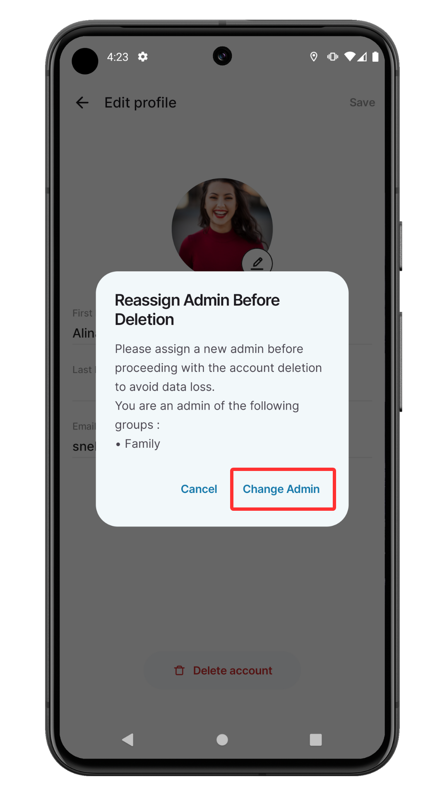
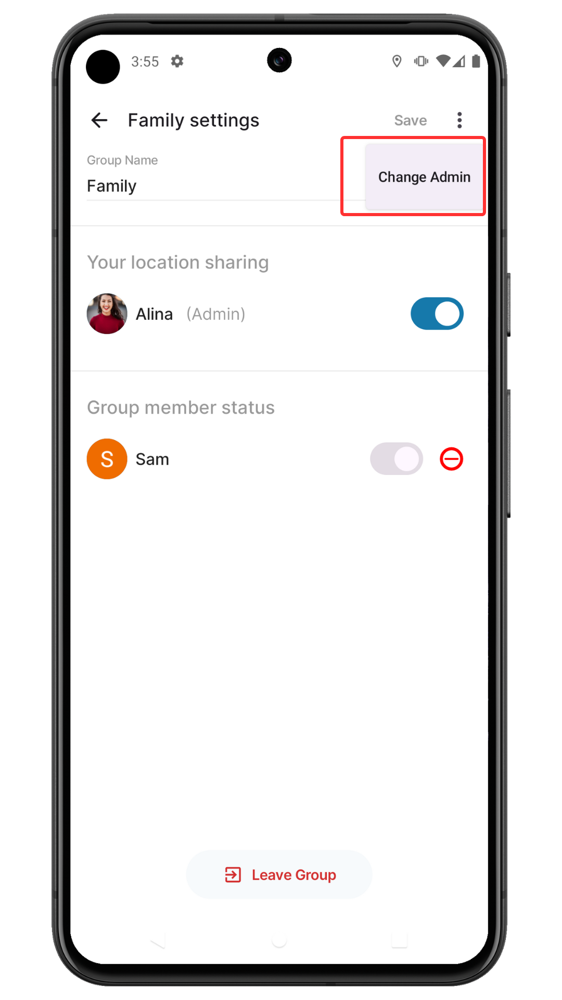

# Grouptrack Account Deletion

If you wish to delete your Grouptrack account, follow these steps:
(Note : If you're an admin of any group, you must have to transfer admin rights to another user before proceeding.)

1. Open the **Grouptrack** app on your device.

2. Go to **Home** and tap on **Settings**.

   

3. In **Settings**, choose **Edit Profile**.

   

4. Scroll to the bottom and tap on the **Delete Account** button.

   

5. If you are an admin of any group, a dialog box will appear requesting you to transfer admin rights before account deletion. Click the **Change Admin** button to proceed to the **Settings** screen.

   

6. Select the group and tap on the **More Options** button.
   - When the menu appears, tap **Change Admin**
   - Select a new admin from the list on the **Change Admin** screen
   
   

7. Once you have transferred all admin rights (or if you were not an admin), you'll see a final confirmation dialog. Tap **Delete Account** to proceed with account deletion.

   

8. Your account will be deleted, and you will be logged out of the app.

If you encounter any issues or need further assistance, you can submit a request by going to **Home > Settings > Contact Support**.
