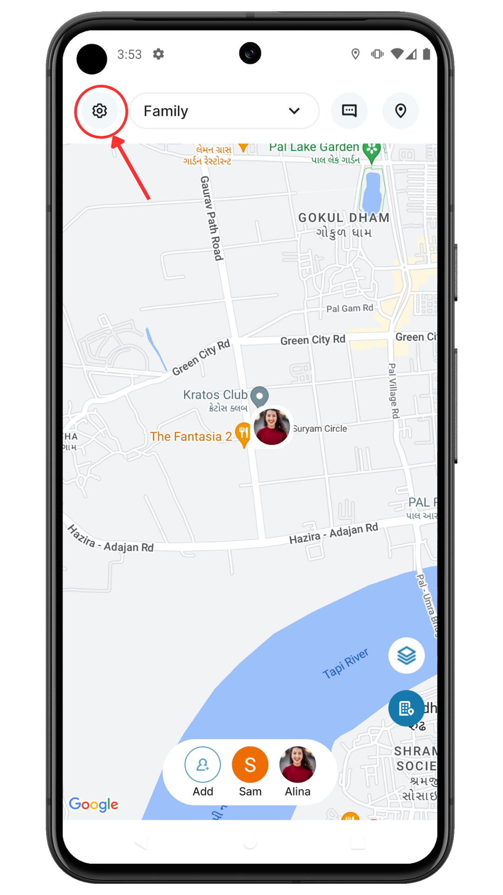
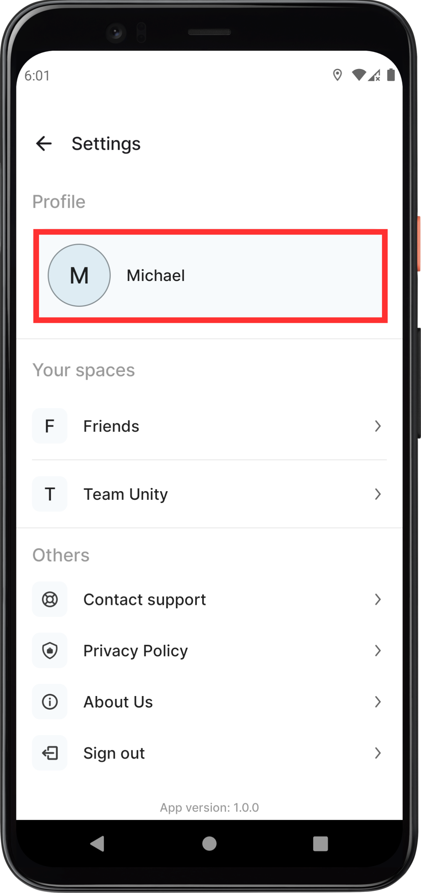
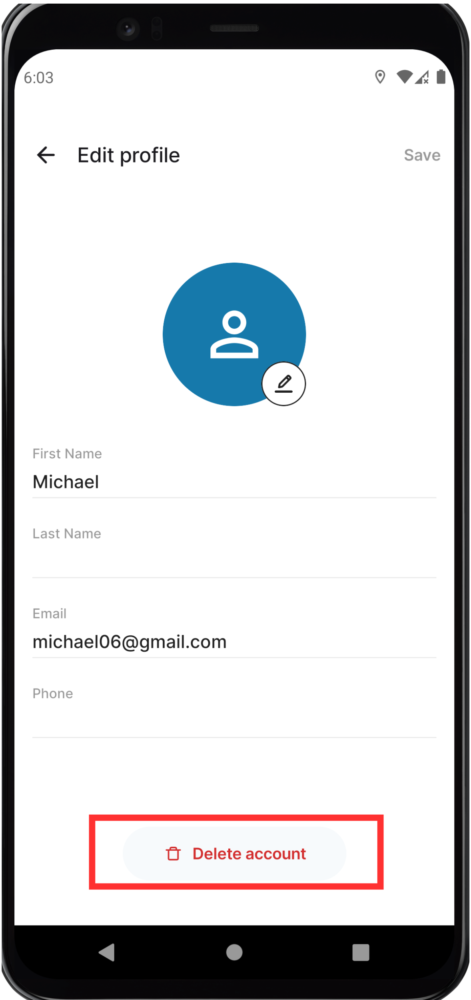
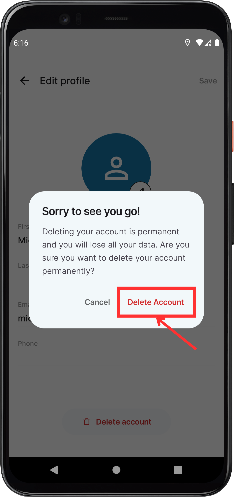

# GroupTrack Account Deletion

If you wish to delete your GroupTrack account, follow these steps:

1. Open the **GroupTrack** app on your device.

2. Go to **Home** and tap on **Settings**.
   

3. In **Settings**, choose **Edit Profile**.
   

4. Scroll to the bottom and tap on the **Delete Account** button.
   

5. Confirm the deletion by tapping on **Delete Account** in the dialog box.
   

6. Your account will be deleted, and you will be logged out of the app.

If you encounter any issues or need further assistance, you can submit a request by going to **Home > Settings > Contact Support**.
